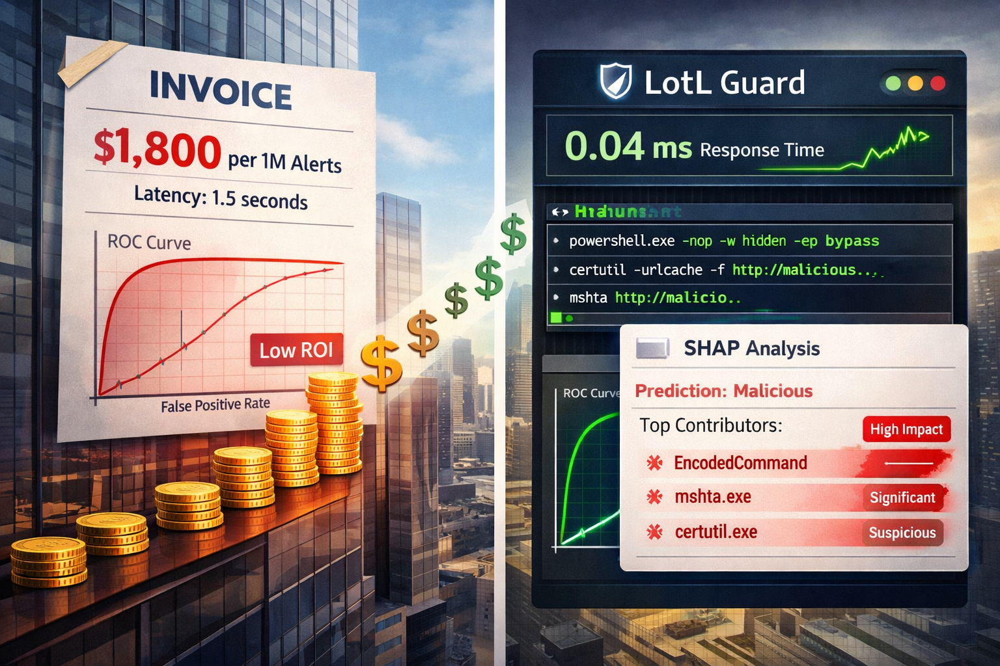

# LinkedIn Post – “How we turned Claude-grade LotL detection into millisecond coffee money”

---

Security teams keep telling me the same thing: “Claude Sonnet can spot living-off-the-land abuse… but our cloud bill says otherwise.”
So I built LotL Guard — a Mac-friendly, CPU-only detector that keeps Claude’s instincts without the price tag.

We took 250 Sysmon events, labeled by Claude itself, and asked a simple question: can classical ML get close to LLM-level LotL detection while being orders of magnitude faster and cheaper?

The answer was yes. A lean TF-IDF + Logistic Regression model now delivers 0.93 precision / 0.89 recall, scores each alert in 0.04 ms, and costs $0.004 per million decisions.

For analysts who still want context, we wrap the score with a RandomForest + SHAP layer and add a local LLM (Ollama + Chainlit) to explain signals like PowerShell + EncodedCommand + LOLBin chaining.

Compared to a production Claude pipeline (1.5 s, $1,800 / 1M alerts), LotL Guard is >2,000× faster (and 37,000× for the text baseline). We also catalogued where the models disagree to guide the next iteration.

Everything — Makefile, uv env, benchmarks, dashboards, Chainlit demo — is open-source:
🔗 https://github.com/msalamah/ai-lotl-guard/

If you’re fighting LOLBins / LotL abuse and want Claude-level context without a cloud invoice, this one’s for you. 🛡️