# Model Comparison Dashboard

- Dataset: `test`
- Source: `artifacts/eval/test_comparison_summary.json`

| Model | Accuracy | P(label=1) | R(label=1) | F1(label=1) | ROC AUC | Avg Precision | Latency (ms/sample) |
| --- | --- | --- | --- | --- | --- | --- | --- |
| gbdt | 0.692 | 0.691 | 0.844 | 0.760 | 0.723 | 0.780 | 0.40 |
| xgb | 0.705 | 0.739 | 0.756 | 0.747 | 0.754 | 0.841 | 0.18 |
| rf | 0.769 | 0.765 | 0.867 | 0.812 | 0.814 | 0.884 | 0.79 |
| text | 0.897 | 0.930 | 0.889 | 0.909 | 0.931 | 0.951 | 0.04 |
| st | 0.897 | 0.930 | 0.889 | 0.909 | 0.921 | 0.946 | 6.90 |
| ensemble_gbdt_tfidf | 0.692 | 0.691 | 0.844 | 0.760 | 0.859 | 0.906 | 0.13 |
| ensemble_gbdt_st | 0.692 | 0.691 | 0.844 | 0.760 | 0.860 | 0.907 | 1.10 |
| ensemble_xgb_tfidf | 0.795 | 0.784 | 0.889 | 0.833 | 0.852 | 0.886 | 0.23 |
| ensemble_xgb_st | 0.769 | 0.765 | 0.867 | 0.812 | 0.848 | 0.889 | 1.16 |
| ensemble_rf_tfidf | 0.859 | 0.870 | 0.889 | 0.879 | 0.879 | 0.911 | 0.67 |
| ensemble_rf_st | 0.846 | 0.851 | 0.889 | 0.870 | 0.866 | 0.901 | 1.60 |
| llm | 0.833 | 0.796 | 0.956 | 0.869 | 0.811 | 0.787 | 5245.23 |

_Note: Latency values for models marked as 0 were not measured during this run and may rely on cached predictions (e.g., the LLM reasoner)._

## Detailed metrics & threshold analysis

### gbdt (n=78)
- Accuracy: 0.692 | ROC-AUC: 0.723 | Average Precision: 0.780
- Label=1 P/R/F1: 0.691 / 0.844 / 0.760
- Macro avg P/R/F1: 0.693 / 0.665 / 0.666
- Weighted avg P/R/F1: 0.693 / 0.692 / 0.680
- Latency: 0.40 ms/sample (total 0.031 s)
Plots:
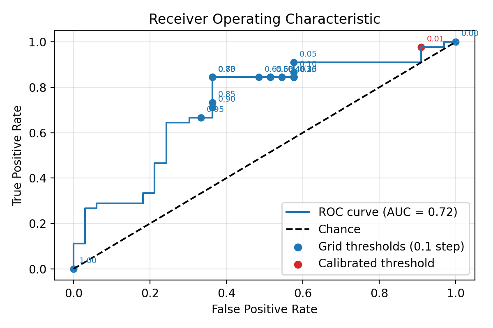
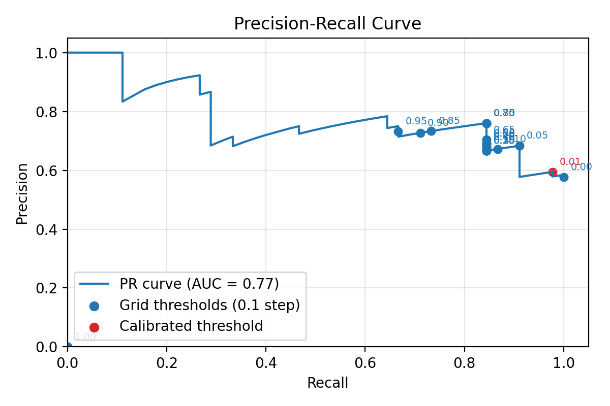
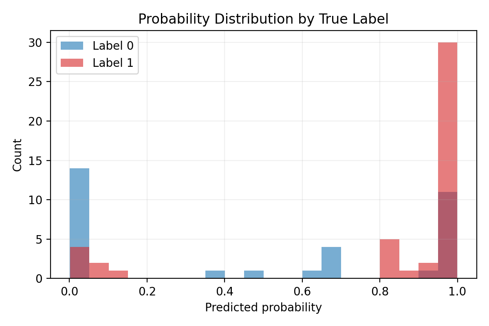

| Threshold | Precision | Recall | TP | FP | TN | FN |
| --- | --- | --- | --- | --- | --- | --- |
| 0.100 | 0.672 | 0.867 | 39 | 19 | 14 | 6 |
| 0.200 | 0.667 | 0.844 | 38 | 19 | 14 | 7 |
| 0.300 | 0.667 | 0.844 | 38 | 19 | 14 | 7 |
| 0.400 | 0.679 | 0.844 | 38 | 18 | 15 | 7 |
| 0.500 | 0.691 | 0.844 | 38 | 17 | 16 | 7 |
| 0.600 | 0.691 | 0.844 | 38 | 17 | 16 | 7 |
| 0.700 | 0.760 | 0.844 | 38 | 12 | 21 | 7 |
| 0.800 | 0.760 | 0.844 | 38 | 12 | 21 | 7 |
| 0.900 | 0.727 | 0.711 | 32 | 12 | 21 | 13 |

### xgb (n=78)
- Accuracy: 0.705 | ROC-AUC: 0.754 | Average Precision: 0.841
- Label=1 P/R/F1: 0.739 / 0.756 / 0.747
- Macro avg P/R/F1: 0.698 / 0.696 / 0.697
- Weighted avg P/R/F1: 0.704 / 0.705 / 0.704
- Latency: 0.18 ms/sample (total 0.014 s)
Plots:
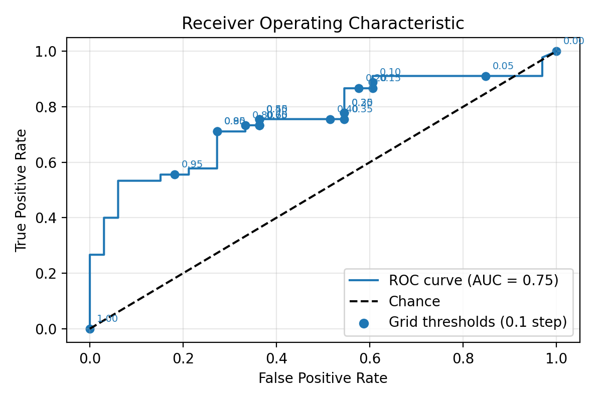
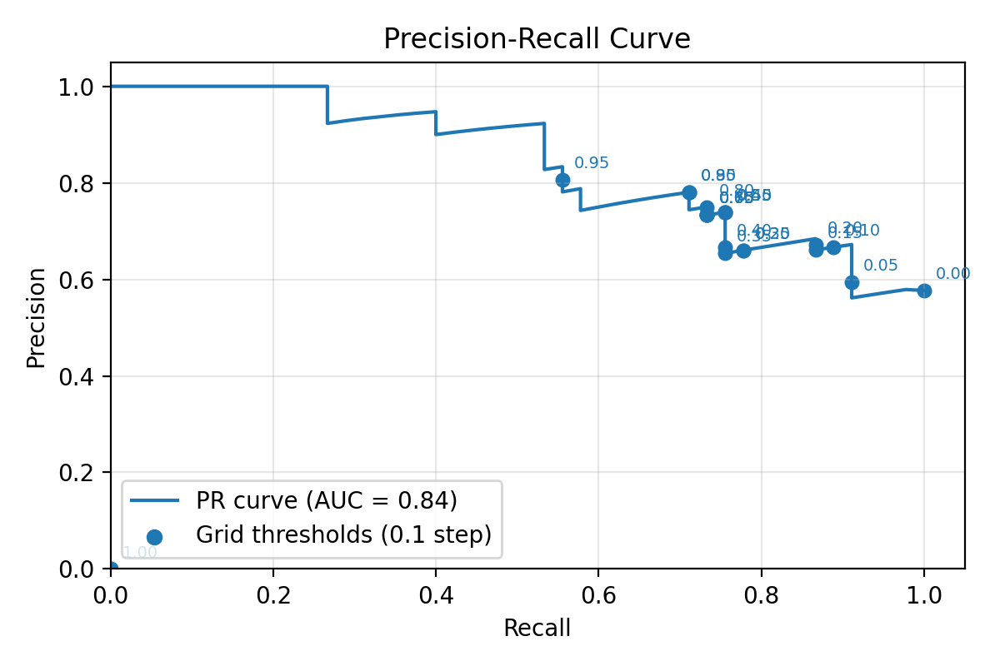
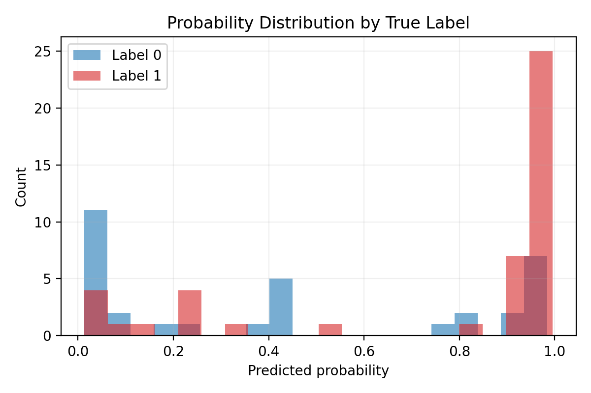

| Threshold | Precision | Recall | TP | FP | TN | FN |
| --- | --- | --- | --- | --- | --- | --- |
| 0.100 | 0.667 | 0.889 | 40 | 20 | 13 | 5 |
| 0.200 | 0.672 | 0.867 | 39 | 19 | 14 | 6 |
| 0.300 | 0.660 | 0.778 | 35 | 18 | 15 | 10 |
| 0.400 | 0.667 | 0.756 | 34 | 17 | 16 | 11 |
| 0.500 | 0.739 | 0.756 | 34 | 12 | 21 | 11 |
| 0.600 | 0.733 | 0.733 | 33 | 12 | 21 | 12 |
| 0.700 | 0.733 | 0.733 | 33 | 12 | 21 | 12 |
| 0.800 | 0.750 | 0.733 | 33 | 11 | 22 | 12 |
| 0.900 | 0.780 | 0.711 | 32 | 9 | 24 | 13 |

### rf (n=78)
- Accuracy: 0.769 | ROC-AUC: 0.814 | Average Precision: 0.884
- Label=1 P/R/F1: 0.765 / 0.867 / 0.812
- Macro avg P/R/F1: 0.771 / 0.752 / 0.756
- Weighted avg P/R/F1: 0.770 / 0.769 / 0.765
- Latency: 0.79 ms/sample (total 0.062 s)
Plots:
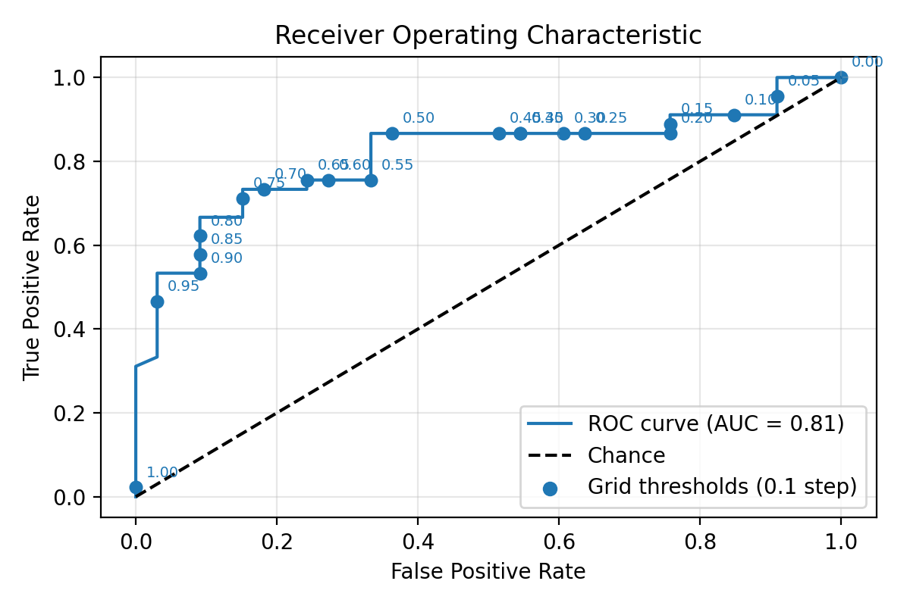
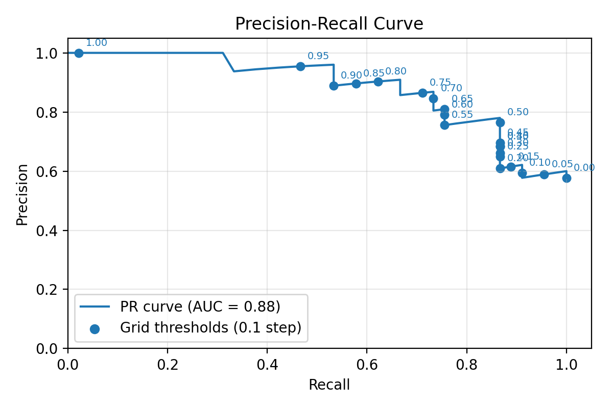
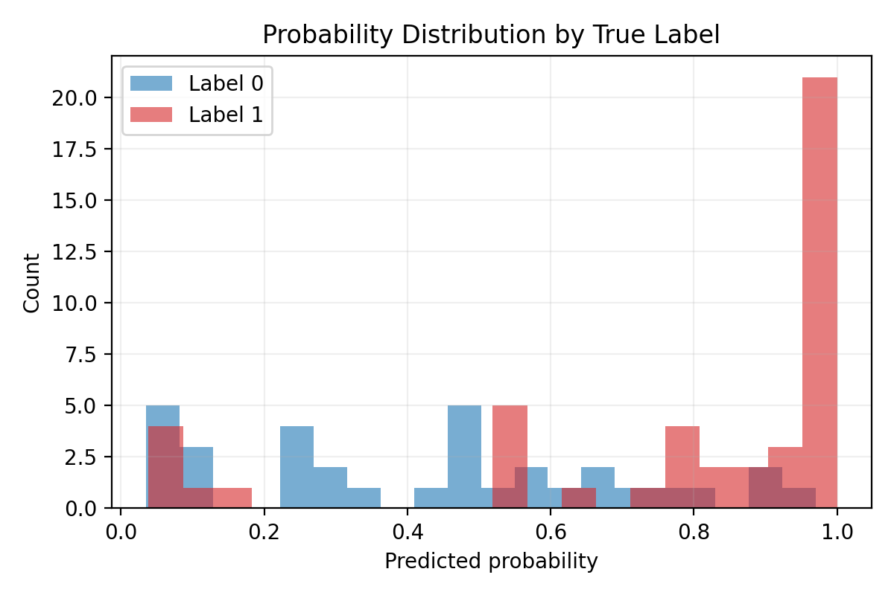

| Threshold | Precision | Recall | TP | FP | TN | FN |
| --- | --- | --- | --- | --- | --- | --- |
| 0.100 | 0.594 | 0.911 | 41 | 28 | 5 | 4 |
| 0.200 | 0.609 | 0.867 | 39 | 25 | 8 | 6 |
| 0.300 | 0.661 | 0.867 | 39 | 20 | 13 | 6 |
| 0.400 | 0.684 | 0.867 | 39 | 18 | 15 | 6 |
| 0.500 | 0.765 | 0.867 | 39 | 12 | 21 | 6 |
| 0.600 | 0.791 | 0.756 | 34 | 9 | 24 | 11 |
| 0.700 | 0.846 | 0.733 | 33 | 6 | 27 | 12 |
| 0.800 | 0.903 | 0.622 | 28 | 3 | 30 | 17 |
| 0.900 | 0.889 | 0.533 | 24 | 3 | 30 | 21 |

### text (n=78)
- Accuracy: 0.897 | ROC-AUC: 0.931 | Average Precision: 0.951
- Label=1 P/R/F1: 0.930 / 0.889 / 0.909
- Macro avg P/R/F1: 0.894 / 0.899 / 0.896
- Weighted avg P/R/F1: 0.899 / 0.897 / 0.898
- Latency: 0.04 ms/sample (total 0.003 s)
Plots:
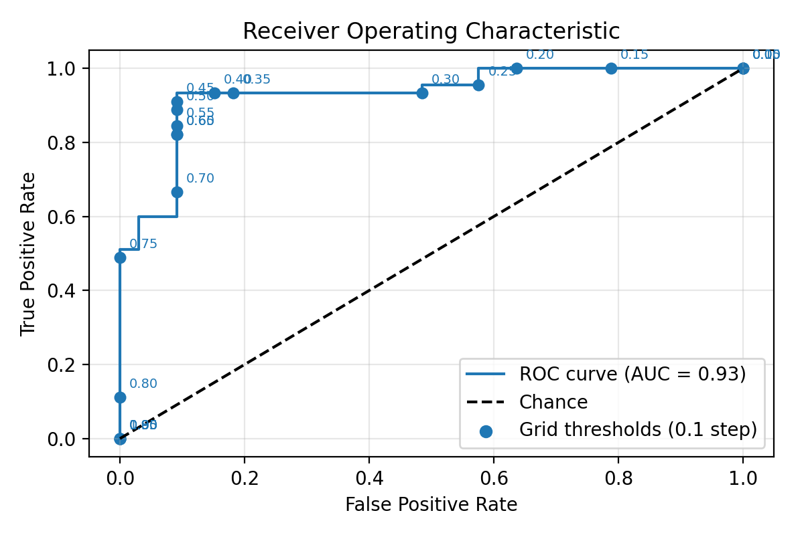
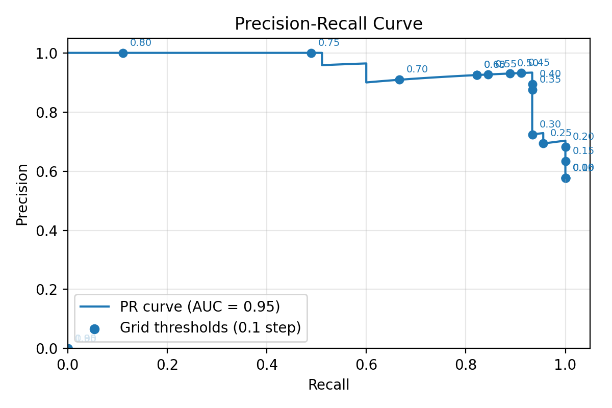
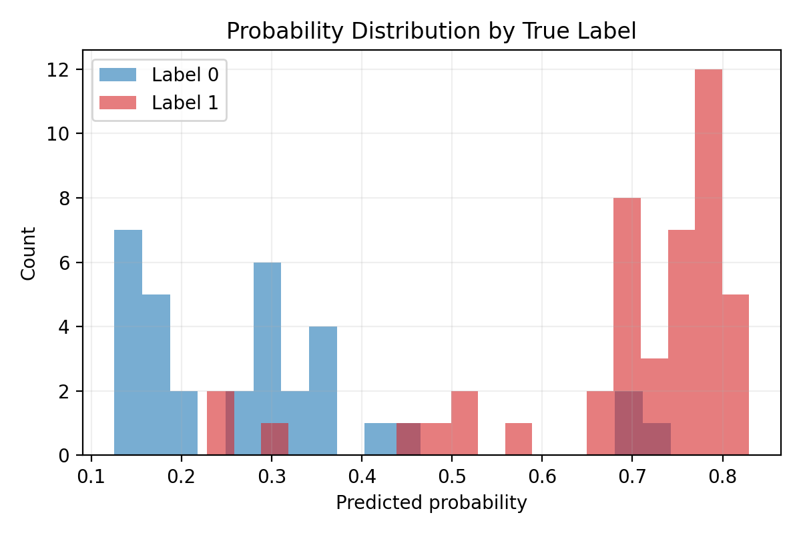

| Threshold | Precision | Recall | TP | FP | TN | FN |
| --- | --- | --- | --- | --- | --- | --- |
| 0.100 | 0.577 | 1.000 | 45 | 33 | 0 | 0 |
| 0.200 | 0.682 | 1.000 | 45 | 21 | 12 | 0 |
| 0.300 | 0.724 | 0.933 | 42 | 16 | 17 | 3 |
| 0.400 | 0.894 | 0.933 | 42 | 5 | 28 | 3 |
| 0.500 | 0.930 | 0.889 | 40 | 3 | 30 | 5 |
| 0.600 | 0.925 | 0.822 | 37 | 3 | 30 | 8 |
| 0.700 | 0.909 | 0.667 | 30 | 3 | 30 | 15 |
| 0.800 | 1.000 | 0.111 | 5 | 0 | 33 | 40 |
| 0.900 | 0.000 | 0.000 | 0 | 0 | 33 | 45 |

### st (n=78)
- Accuracy: 0.897 | ROC-AUC: 0.921 | Average Precision: 0.946
- Label=1 P/R/F1: 0.930 / 0.889 / 0.909
- Macro avg P/R/F1: 0.894 / 0.899 / 0.896
- Weighted avg P/R/F1: 0.899 / 0.897 / 0.898
- Latency: 6.90 ms/sample (total 0.538 s)
Plots:
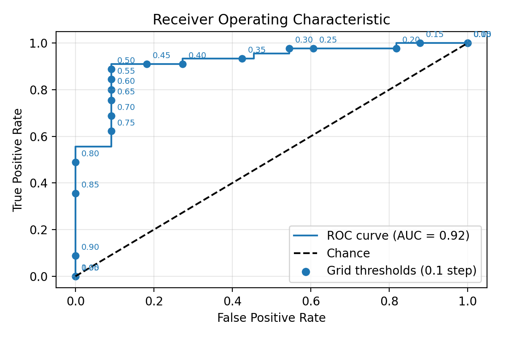
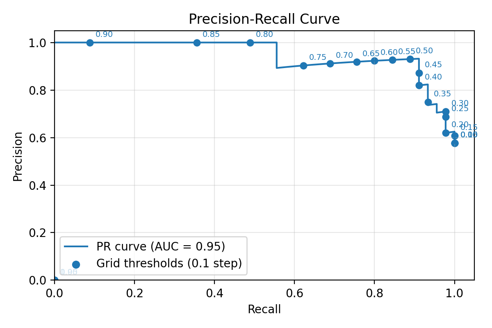
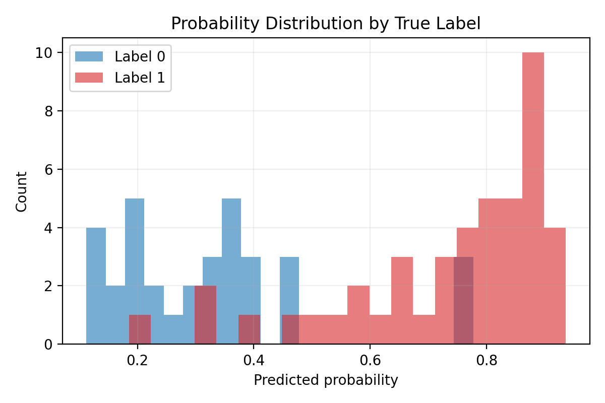

| Threshold | Precision | Recall | TP | FP | TN | FN |
| --- | --- | --- | --- | --- | --- | --- |
| 0.100 | 0.577 | 1.000 | 45 | 33 | 0 | 0 |
| 0.200 | 0.620 | 0.978 | 44 | 27 | 6 | 1 |
| 0.300 | 0.710 | 0.978 | 44 | 18 | 15 | 1 |
| 0.400 | 0.820 | 0.911 | 41 | 9 | 24 | 4 |
| 0.500 | 0.930 | 0.889 | 40 | 3 | 30 | 5 |
| 0.600 | 0.923 | 0.800 | 36 | 3 | 30 | 9 |
| 0.700 | 0.912 | 0.689 | 31 | 3 | 30 | 14 |
| 0.800 | 1.000 | 0.489 | 22 | 0 | 33 | 23 |
| 0.900 | 1.000 | 0.089 | 4 | 0 | 33 | 41 |

### ensemble_gbdt_tfidf (n=78)
- Accuracy: 0.692 | ROC-AUC: 0.859 | Average Precision: 0.906
- Label=1 P/R/F1: 0.691 / 0.844 / 0.760
- Macro avg P/R/F1: 0.693 / 0.665 / 0.666
- Weighted avg P/R/F1: 0.693 / 0.692 / 0.680
- Latency: 0.13 ms/sample (total 0.010 s)
Plots:
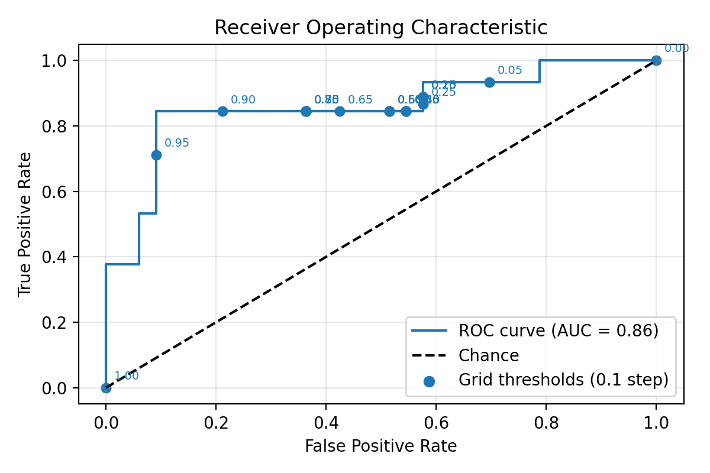
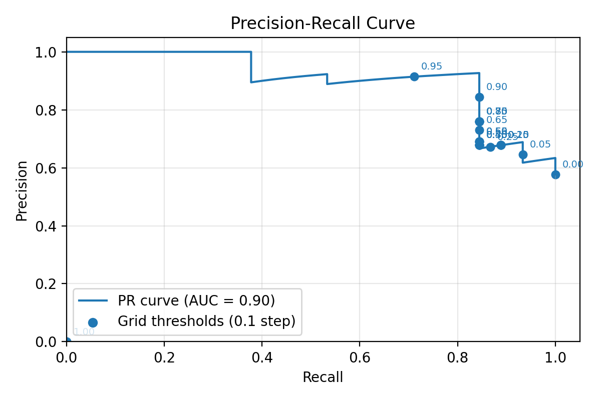
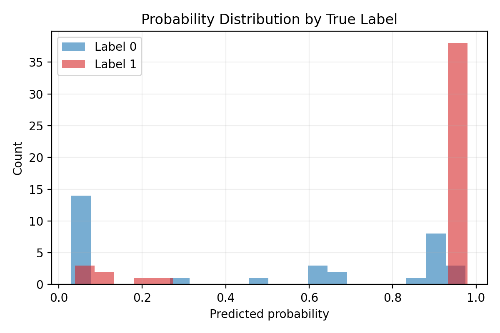

| Threshold | Precision | Recall | TP | FP | TN | FN |
| --- | --- | --- | --- | --- | --- | --- |
| 0.100 | 0.678 | 0.889 | 40 | 19 | 14 | 5 |
| 0.200 | 0.678 | 0.889 | 40 | 19 | 14 | 5 |
| 0.300 | 0.679 | 0.844 | 38 | 18 | 15 | 7 |
| 0.400 | 0.679 | 0.844 | 38 | 18 | 15 | 7 |
| 0.500 | 0.691 | 0.844 | 38 | 17 | 16 | 7 |
| 0.600 | 0.691 | 0.844 | 38 | 17 | 16 | 7 |
| 0.700 | 0.760 | 0.844 | 38 | 12 | 21 | 7 |
| 0.800 | 0.760 | 0.844 | 38 | 12 | 21 | 7 |
| 0.900 | 0.844 | 0.844 | 38 | 7 | 26 | 7 |

### ensemble_gbdt_st (n=78)
- Accuracy: 0.692 | ROC-AUC: 0.860 | Average Precision: 0.907
- Label=1 P/R/F1: 0.691 / 0.844 / 0.760
- Macro avg P/R/F1: 0.693 / 0.665 / 0.666
- Weighted avg P/R/F1: 0.693 / 0.692 / 0.680
- Latency: 1.10 ms/sample (total 0.086 s)
Plots:
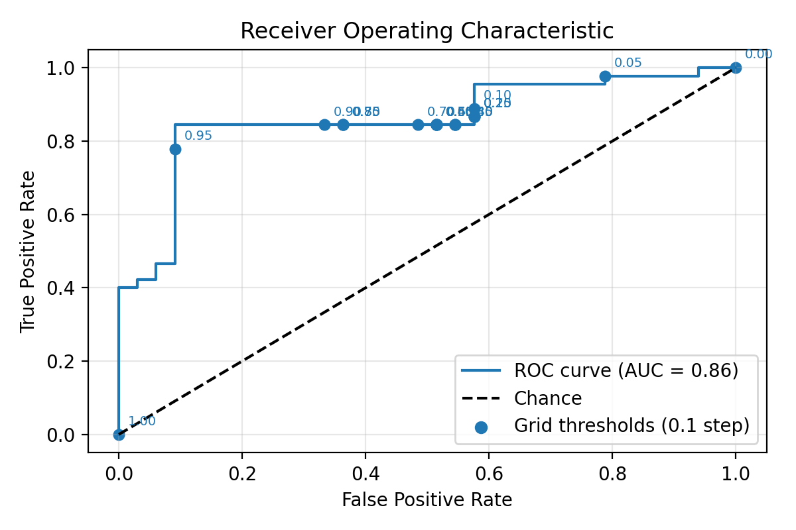
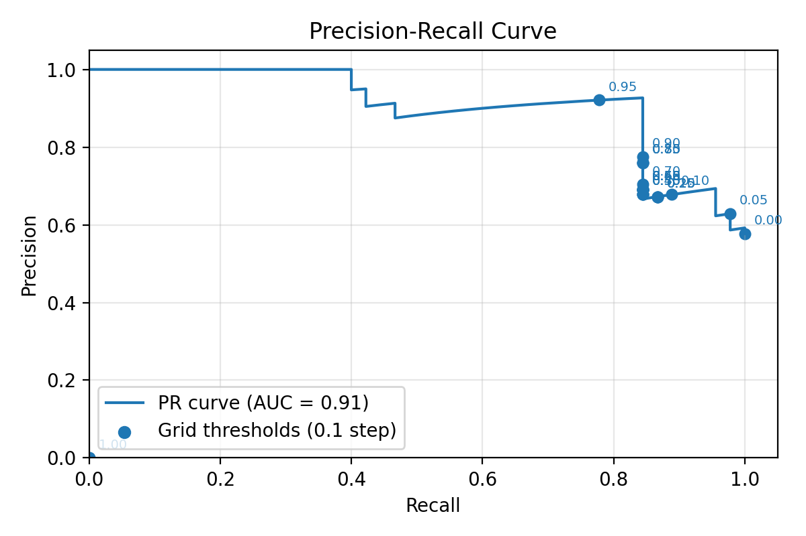
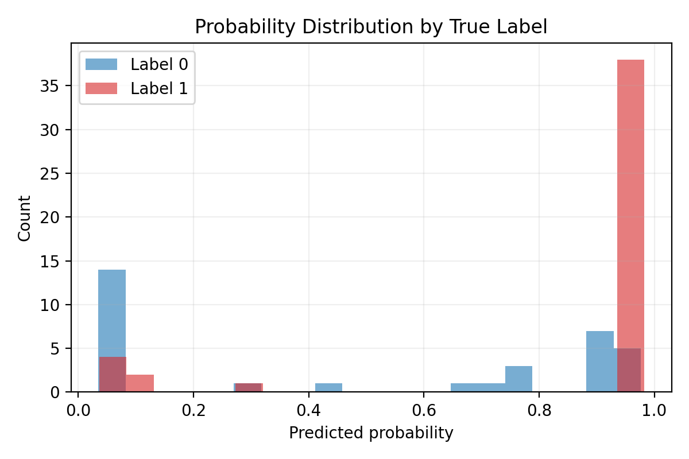

| Threshold | Precision | Recall | TP | FP | TN | FN |
| --- | --- | --- | --- | --- | --- | --- |
| 0.100 | 0.678 | 0.889 | 40 | 19 | 14 | 5 |
| 0.200 | 0.672 | 0.867 | 39 | 19 | 14 | 6 |
| 0.300 | 0.679 | 0.844 | 38 | 18 | 15 | 7 |
| 0.400 | 0.679 | 0.844 | 38 | 18 | 15 | 7 |
| 0.500 | 0.691 | 0.844 | 38 | 17 | 16 | 7 |
| 0.600 | 0.691 | 0.844 | 38 | 17 | 16 | 7 |
| 0.700 | 0.704 | 0.844 | 38 | 16 | 17 | 7 |
| 0.800 | 0.760 | 0.844 | 38 | 12 | 21 | 7 |
| 0.900 | 0.776 | 0.844 | 38 | 11 | 22 | 7 |

### ensemble_xgb_tfidf (n=78)
- Accuracy: 0.795 | ROC-AUC: 0.852 | Average Precision: 0.886
- Label=1 P/R/F1: 0.784 / 0.889 / 0.833
- Macro avg P/R/F1: 0.800 / 0.778 / 0.783
- Weighted avg P/R/F1: 0.797 / 0.795 / 0.791
- Latency: 0.23 ms/sample (total 0.018 s)
Plots:
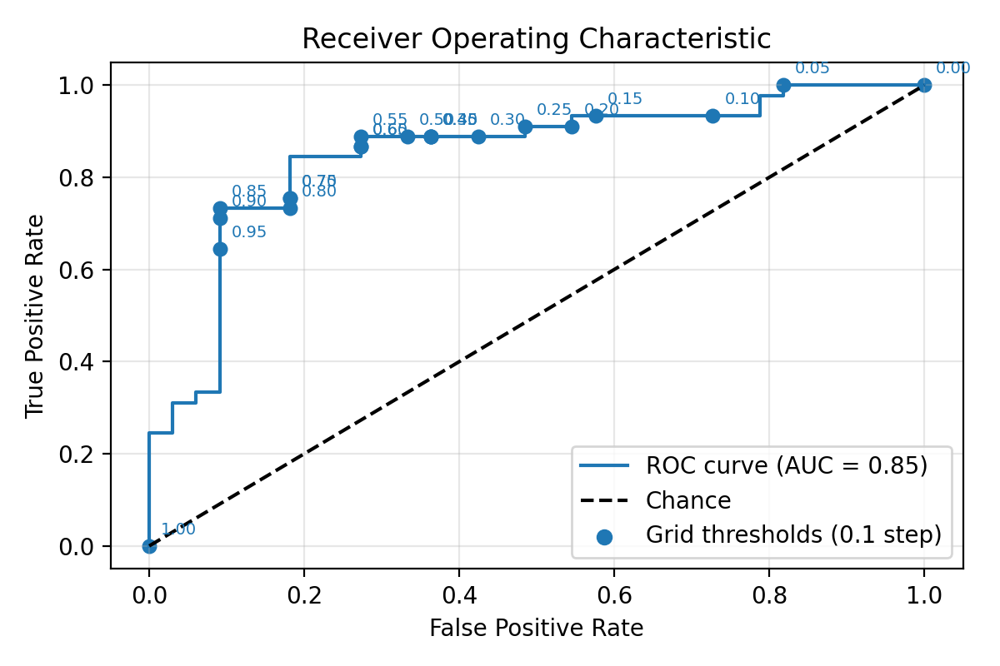
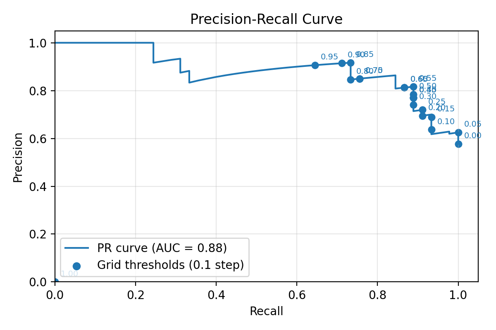
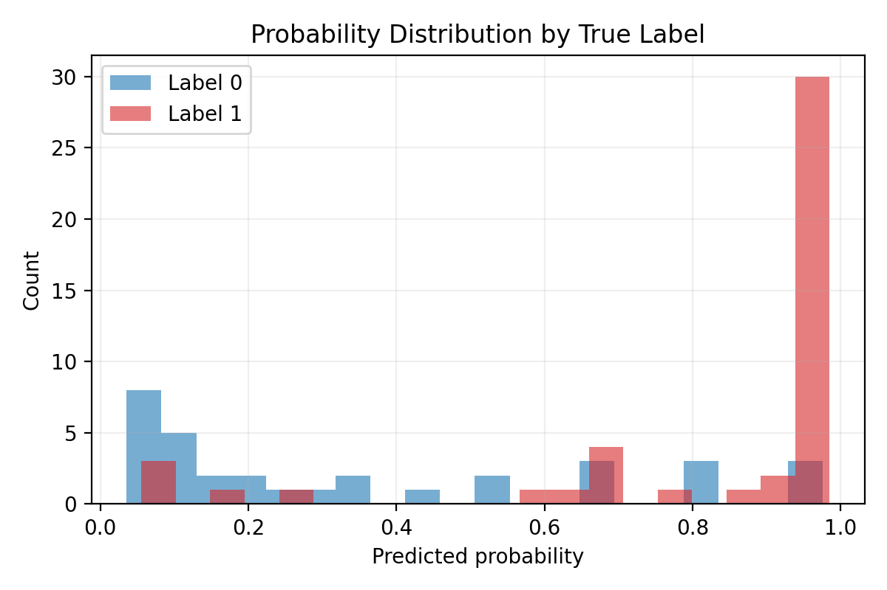

| Threshold | Precision | Recall | TP | FP | TN | FN |
| --- | --- | --- | --- | --- | --- | --- |
| 0.100 | 0.636 | 0.933 | 42 | 24 | 9 | 3 |
| 0.200 | 0.695 | 0.911 | 41 | 18 | 15 | 4 |
| 0.300 | 0.741 | 0.889 | 40 | 14 | 19 | 5 |
| 0.400 | 0.769 | 0.889 | 40 | 12 | 21 | 5 |
| 0.500 | 0.784 | 0.889 | 40 | 11 | 22 | 5 |
| 0.600 | 0.812 | 0.867 | 39 | 9 | 24 | 6 |
| 0.700 | 0.850 | 0.756 | 34 | 6 | 27 | 11 |
| 0.800 | 0.846 | 0.733 | 33 | 6 | 27 | 12 |
| 0.900 | 0.914 | 0.711 | 32 | 3 | 30 | 13 |

### ensemble_xgb_st (n=78)
- Accuracy: 0.769 | ROC-AUC: 0.848 | Average Precision: 0.889
- Label=1 P/R/F1: 0.765 / 0.867 / 0.812
- Macro avg P/R/F1: 0.771 / 0.752 / 0.756
- Weighted avg P/R/F1: 0.770 / 0.769 / 0.765
- Latency: 1.16 ms/sample (total 0.091 s)
Plots:
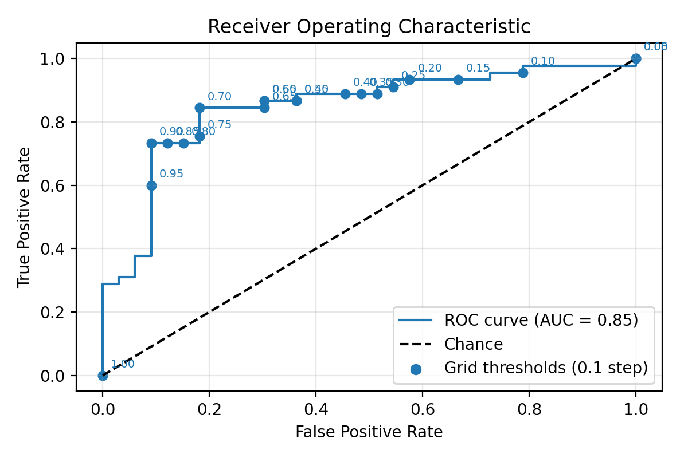
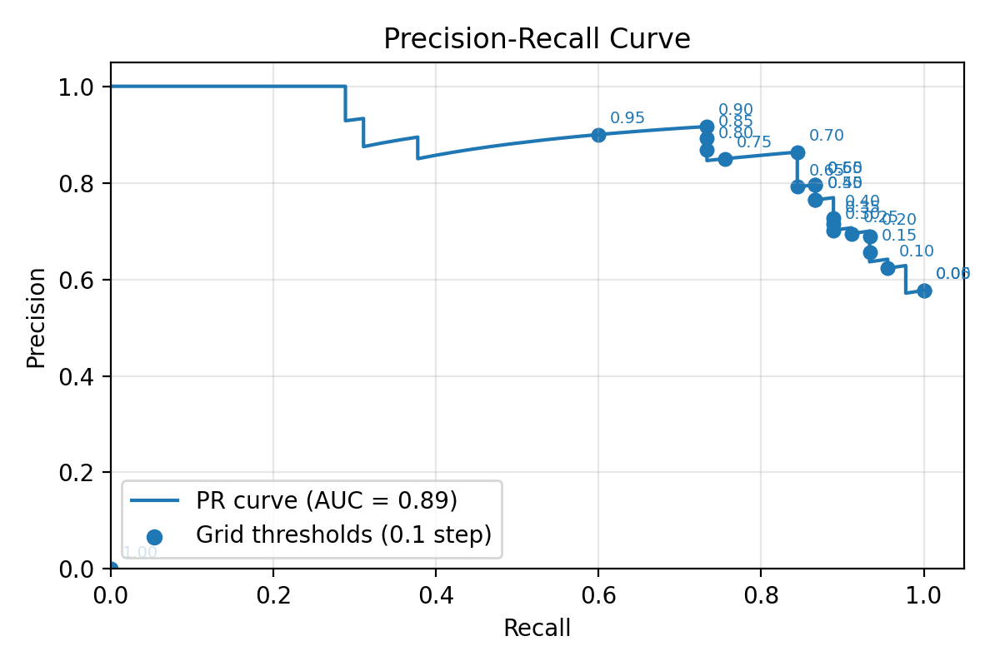
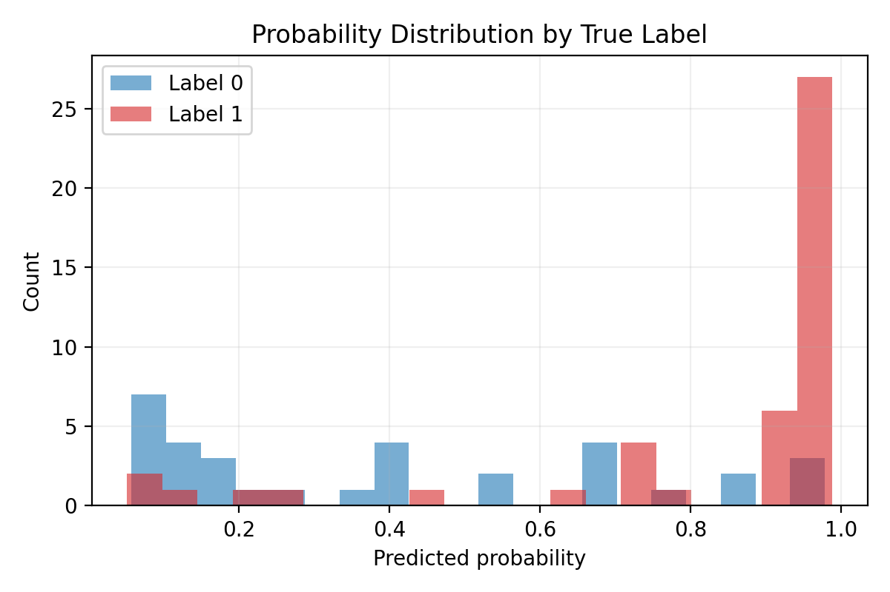

| Threshold | Precision | Recall | TP | FP | TN | FN |
| --- | --- | --- | --- | --- | --- | --- |
| 0.100 | 0.623 | 0.956 | 43 | 26 | 7 | 2 |
| 0.200 | 0.689 | 0.933 | 42 | 19 | 14 | 3 |
| 0.300 | 0.702 | 0.889 | 40 | 17 | 16 | 5 |
| 0.400 | 0.727 | 0.889 | 40 | 15 | 18 | 5 |
| 0.500 | 0.765 | 0.867 | 39 | 12 | 21 | 6 |
| 0.600 | 0.796 | 0.867 | 39 | 10 | 23 | 6 |
| 0.700 | 0.864 | 0.844 | 38 | 6 | 27 | 7 |
| 0.800 | 0.868 | 0.733 | 33 | 5 | 28 | 12 |
| 0.900 | 0.917 | 0.733 | 33 | 3 | 30 | 12 |

### ensemble_rf_tfidf (n=78)
- Accuracy: 0.859 | ROC-AUC: 0.879 | Average Precision: 0.911
- Label=1 P/R/F1: 0.870 / 0.889 / 0.879
- Macro avg P/R/F1: 0.857 / 0.854 / 0.855
- Weighted avg P/R/F1: 0.859 / 0.859 / 0.859
- Latency: 0.67 ms/sample (total 0.052 s)
Plots:
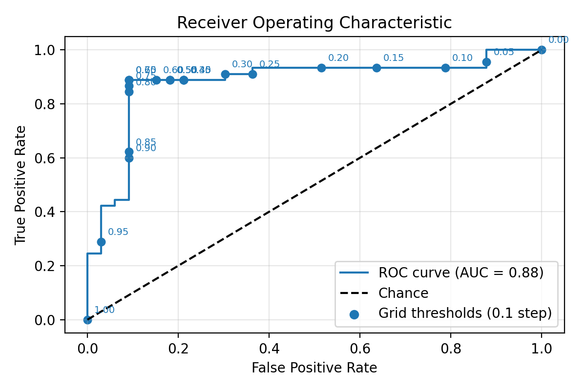
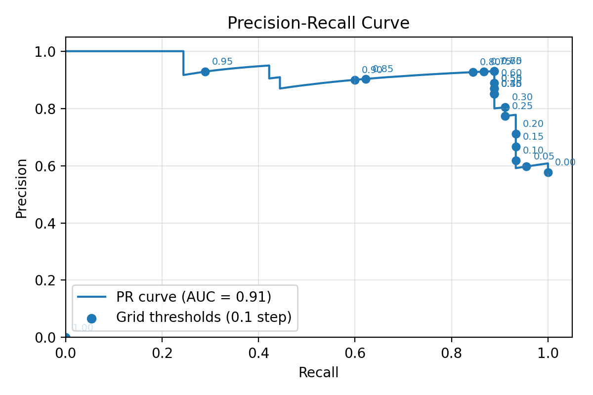
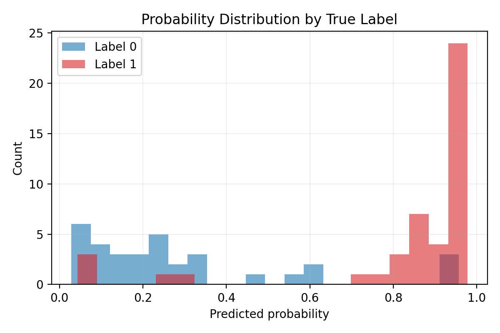

| Threshold | Precision | Recall | TP | FP | TN | FN |
| --- | --- | --- | --- | --- | --- | --- |
| 0.100 | 0.618 | 0.933 | 42 | 26 | 7 | 3 |
| 0.200 | 0.712 | 0.933 | 42 | 17 | 16 | 3 |
| 0.300 | 0.804 | 0.911 | 41 | 10 | 23 | 4 |
| 0.400 | 0.851 | 0.889 | 40 | 7 | 26 | 5 |
| 0.500 | 0.870 | 0.889 | 40 | 6 | 27 | 5 |
| 0.600 | 0.889 | 0.889 | 40 | 5 | 28 | 5 |
| 0.700 | 0.930 | 0.889 | 40 | 3 | 30 | 5 |
| 0.800 | 0.927 | 0.844 | 38 | 3 | 30 | 7 |
| 0.900 | 0.900 | 0.600 | 27 | 3 | 30 | 18 |

### ensemble_rf_st (n=78)
- Accuracy: 0.846 | ROC-AUC: 0.866 | Average Precision: 0.901
- Label=1 P/R/F1: 0.851 / 0.889 / 0.870
- Macro avg P/R/F1: 0.845 / 0.838 / 0.841
- Weighted avg P/R/F1: 0.846 / 0.846 / 0.845
- Latency: 1.60 ms/sample (total 0.125 s)
Plots:
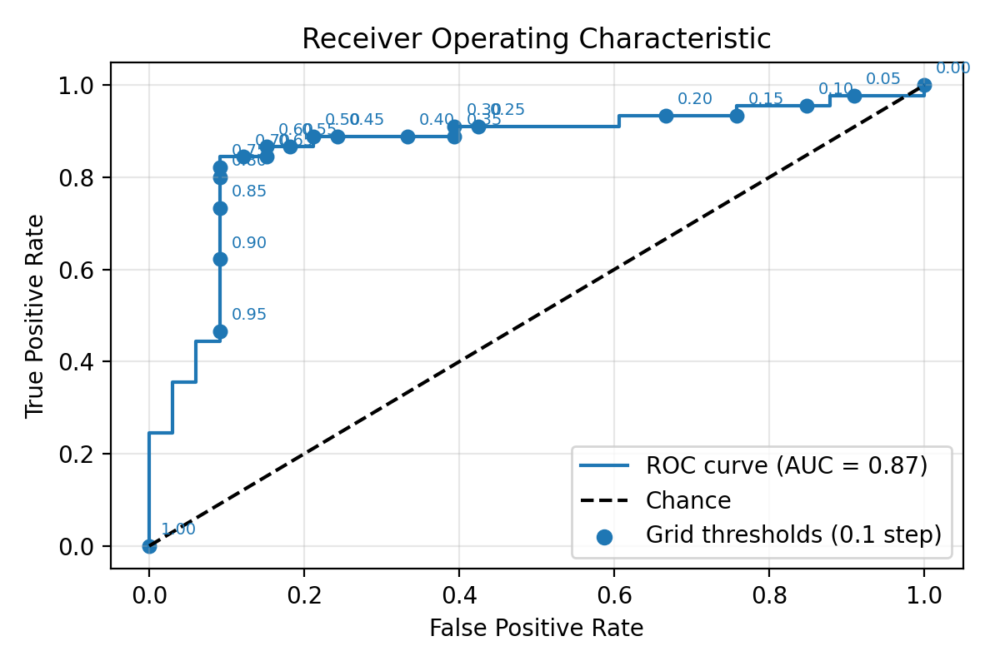
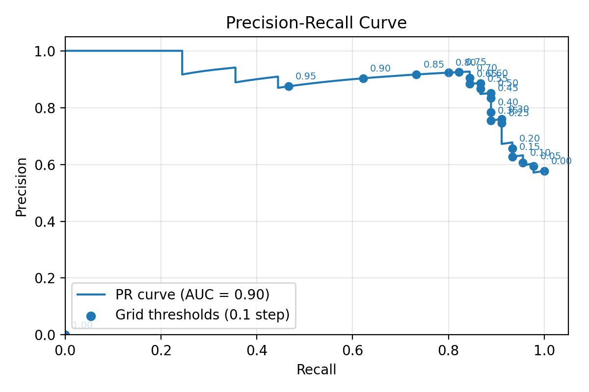
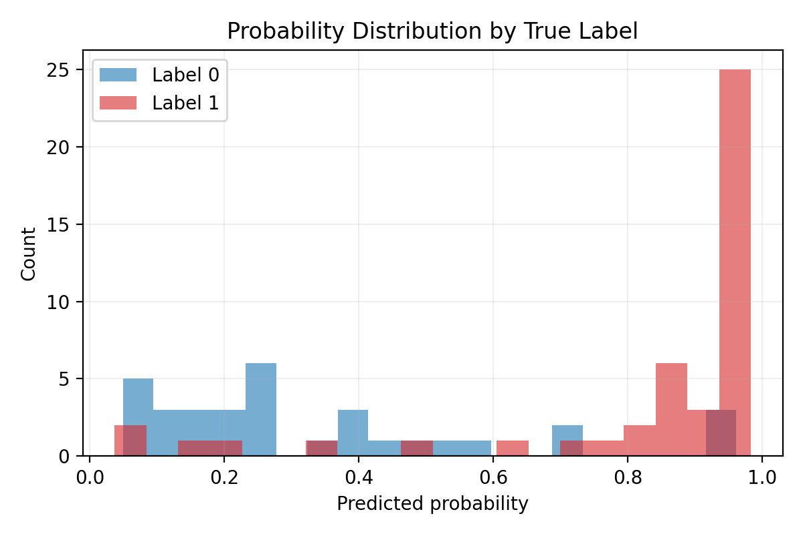

| Threshold | Precision | Recall | TP | FP | TN | FN |
| --- | --- | --- | --- | --- | --- | --- |
| 0.100 | 0.606 | 0.956 | 43 | 28 | 5 | 2 |
| 0.200 | 0.656 | 0.933 | 42 | 22 | 11 | 3 |
| 0.300 | 0.759 | 0.911 | 41 | 13 | 20 | 4 |
| 0.400 | 0.784 | 0.889 | 40 | 11 | 22 | 5 |
| 0.500 | 0.851 | 0.889 | 40 | 7 | 26 | 5 |
| 0.600 | 0.886 | 0.867 | 39 | 5 | 28 | 6 |
| 0.700 | 0.905 | 0.844 | 38 | 4 | 29 | 7 |
| 0.800 | 0.923 | 0.800 | 36 | 3 | 30 | 9 |
| 0.900 | 0.903 | 0.622 | 28 | 3 | 30 | 17 |

### llm (n=78)
- Accuracy: 0.833 | ROC-AUC: 0.811 | Average Precision: 0.787
- Label=1 P/R/F1: 0.796 / 0.956 / 0.869
- Macro avg P/R/F1: 0.856 / 0.811 / 0.820
- Weighted avg P/R/F1: 0.847 / 0.833 / 0.828
- Latency: 5245.23 ms/sample (total 409.128 s)

| Threshold | Precision | Recall | TP | FP | TN | FN |
| --- | --- | --- | --- | --- | --- | --- |
| 0.100 | 0.796 | 0.956 | 43 | 11 | 22 | 2 |
| 0.200 | 0.796 | 0.956 | 43 | 11 | 22 | 2 |
| 0.300 | 0.796 | 0.956 | 43 | 11 | 22 | 2 |
| 0.400 | 0.796 | 0.956 | 43 | 11 | 22 | 2 |
| 0.500 | 0.796 | 0.956 | 43 | 11 | 22 | 2 |
| 0.600 | 0.796 | 0.956 | 43 | 11 | 22 | 2 |
| 0.700 | 0.796 | 0.956 | 43 | 11 | 22 | 2 |
| 0.800 | 0.796 | 0.956 | 43 | 11 | 22 | 2 |
| 0.900 | 0.796 | 0.956 | 43 | 11 | 22 | 2 |

## Cost & latency comparison

| Model | Precision | Recall | Latency (ms) | Cost $/1M | Speedup vs Claude | Savings vs Claude |
| --- | --- | --- | --- | --- | --- | --- |
| claude | 1.000 | 1.000 | 1500.00 | 1800.0000 | 1.000 | 1.000 |
| gbdt | 0.691 | 0.844 | 0.40 | 0.0544 | 3758.966 | 33063.944 |
| xgb | 0.739 | 0.756 | 0.18 | 0.0202 | 8215.499 | 89281.045 |
| rf | 0.765 | 0.867 | 0.79 | 0.0672 | 1887.892 | 26781.105 |
| text | 0.930 | 0.889 | 0.04 | 0.0044 | 36922.598 | 408396.344 |
| st | 0.930 | 0.889 | 6.90 | 2.2810 | 217.383 | 789.120 |
| ensemble_gbdt_tfidf | 0.691 | 0.844 | 0.13 | 0.0101 | 11794.701 | 178751.585 |
| ensemble_gbdt_st | 0.691 | 0.844 | 1.10 | 0.8522 | 1363.678 | 2112.148 |
| ensemble_xgb_tfidf | 0.784 | 0.889 | 0.23 | 0.0244 | 6650.987 | 73684.379 |
| ensemble_xgb_st | 0.765 | 0.867 | 1.16 | 0.8918 | 1290.751 | 2018.490 |
| ensemble_rf_tfidf | 0.870 | 0.889 | 0.67 | 0.0696 | 2244.915 | 25852.109 |
| ensemble_rf_st | 0.851 | 0.889 | 1.60 | 1.4272 | 935.474 | 1261.193 |
| llm | 0.796 | 0.956 | 5245.23 | 79.8413 | 0.286 | 22.545 |