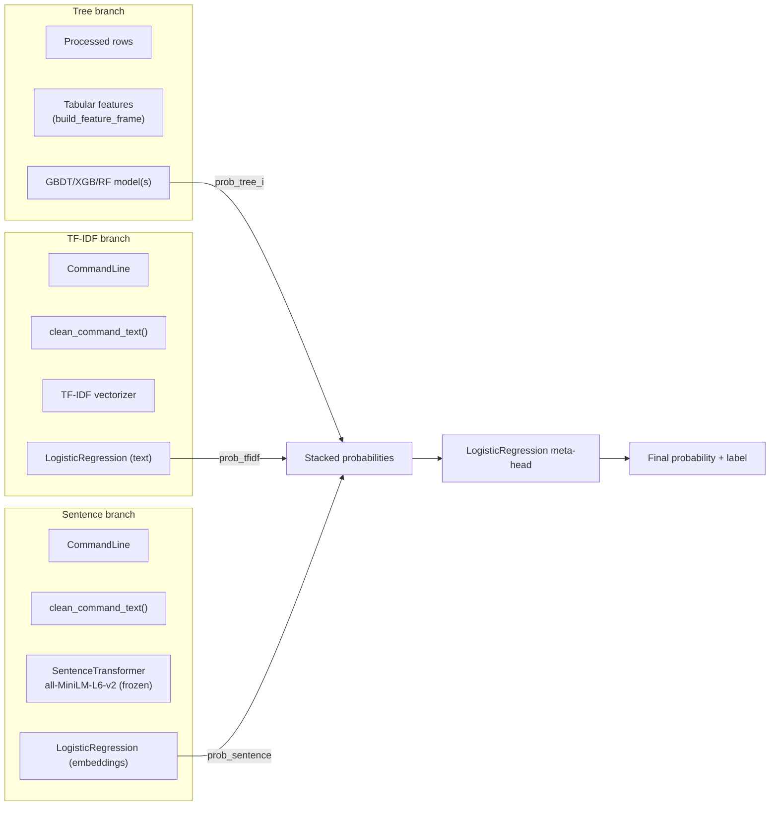

# Tree + Text Ensemble (EPIC F3)

This note captures the architecture, training flow, and evaluation steps for the hybrid ensemble that combines any trained tabular tree model (GBDT, XGBoost, RandomForest) with the TF-IDF text classifier.

## Architecture



- **Providers**: each base model is wrapped as a `ProbabilityProvider` that exposes `predict(df) -> P(label=1)`.
  - Tree providers use `prepare_feature_matrix` with the saved feature list + categorical metadata, then call `predict_proba`.
  - The TF-IDF provider reuses `clean_command_text` + vectorizer + classifier from EPIC F1.
  - The SentenceTransformer provider loads the saved MiniLM config (`st_config.json`), instantiates the frozen encoder, produces embeddings, and runs the sentence-level logistic regression head from EPIC F2.
- **Meta-classifier**: a balanced logistic regression on the stacked probabilities (tree, TF-IDF, MiniLM). Training labels remain the Claude `_label`.
- **Artifacts**: `artifacts/models/ensemble.pkl` (dataclass with classifier + provider metadata), `ensemble_config.json`, `ensemble_feature_list.json`, `artifacts/eval/ensemble_val_metrics.json`, and validation plots/threshold tables under `artifacts/reports/ensemble_*`.

## Training Pipeline

1. **Prerequisites**
   - Run preprocessing/splitting so `artifacts/processed.parquet` and `artifacts/splits.json` exist (`make preprocess`).
   - Train at least one tree model (`uv run python scripts/train.py --model gbdt`, and/or `--model xgb`, `--model rf`). The ensemble will automatically pick the highest-priority tree artifact available (preference: GBDT → XGB → RF). Override this by passing a custom `provider_metadata` to `train_ensemble` if you need a specific combination.
   - Train at least one text model. By default we prefer the TF-IDF head (`uv run python scripts/train.py --model text`); if that's missing but the sentence-transformer baseline exists, the ensemble will fall back to MiniLM.
   - (Optional) Train the sentence-transformer baseline (`uv run python scripts/train.py --model st`) so you can choose it instead of TF-IDF by adjusting metadata.
   - If MiniLM weights are not cached locally, run  
     ```bash
     uv run python -c "from sentence_transformers import SentenceTransformer; SentenceTransformer('all-MiniLM-L6-v2')"
     ```  
     to download them (or set `SENTENCE_TRANSFORMERS_HOME` to a pre-cached directory).

2. **Command**
   ```bash
   uv run python scripts/train.py --model ensemble
   ```

3. **Outputs**
   - `artifacts/models/ensemble.pkl`
   - `artifacts/models/ensemble_config.json` (lists every provider: type, model paths, feature lists)
   - `artifacts/models/ensemble_feature_list.json` (e.g., `["prob_gbdt","prob_tfidf"]`)
   - `artifacts/eval/ensemble_val_metrics.json` (accuracy, ROC-AUC, average precision, per-label + macro/weighted stats)

The trainer automatically discovers whichever providers exist in `artifacts/models/` (GBDT, XGB, RF, plus TF-IDF). If you only want a subset, remove the unused artifacts or pass a custom metadata list via `params`.

## Evaluation & Threshold Plots

`make evaluate` now runs:
```bash
MPLBACKEND=Agg MPLCONFIGDIR=.matplotlib-cache \
uv run python scripts/plot_eval_curves.py \
  --model-path artifacts/models/ensemble.pkl \
  --model-config-path artifacts/models/ensemble_config.json \
  --feature-list-path artifacts/models/ensemble_feature_list.json \
  --text-mode ensemble \
  --prefix ensemble \
  --output-dir artifacts/reports
```
The plotting script rebuilds each provider (using the metadata recorded in `ensemble_config.json`), scores the validation split, and emits:
- `ensemble_roc_curve.png`, `ensemble_pr_curve.png`, `ensemble_prob_distribution.png`
- `ensemble_threshold_metrics.json` with precision/recall/TP/FP/TN/FN for thresholds 0.00→1.00 in 0.05 increments (calibrated threshold highlighted if available).

## Full Command Checklist

Assuming `data/dataset.jsonl` is present:

```bash
# 1. Preprocess and split dataset
uv run python scripts/preprocess.py --input data/dataset.jsonl --artifacts artifacts

# 2. Train base models (choose any combination)
uv run python scripts/train.py --model gbdt
uv run python scripts/train.py --model xgb        # optional
uv run python scripts/train.py --model rf         # optional
uv run python scripts/train.py --model text

# 3. Train MiniLM text model so the ensemble can include it
uv run python scripts/train.py --model st

# 4. Train ensemble (requires ≥1 tree model + TF-IDF, sentence branch included automatically if available)
uv run python scripts/train.py --model ensemble

# 5. Generate evaluation plots + threshold metrics for every model
make evaluate   # or run the plot command above just for the ensemble
```

After step 5 you will have comparable metrics tables for every detector, including the ensemble’s `{precision, recall}` at multiple operating points, ready for reporting or deployment threshold selection.
