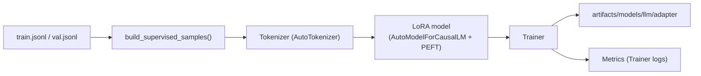

# Local LLM Fine-Tuning (EPIC G2)

We fine-tune a small causal LM using LoRA/QLoRA on the instruction dataset built in EPIC G1.

## Requirements

- Prepared data under `artifacts/llm/train.jsonl` and `val.jsonl` (run `scripts/prepare_llm_data.py` first).
- GPU with sufficient memory (TinyLlama fits on a single 24 GB GPU with fp16 + gradient checkpointing). For CPU-only, expect extremely long runtimes.
- Installed dependencies: `transformers`, `peft`, `accelerate`, `datasets` (already in `pyproject.toml`).

## Workflow



## Command

```bash
uv run python scripts/train_llm.py \
  --train-path artifacts/llm/train.jsonl \
  --val-path artifacts/llm/val.jsonl \
  --base-model TinyLlama/TinyLlama-1.1B-Chat-v1.0 \
  --output-dir artifacts/models/llm \
  --epochs 3 \
  --batch-size 2 \
  --max-length 1024
```

Arguments:
- `--base-model`: Hugging Face model to adapt. Use a locally downloaded path if working fully offline.
- `--output-dir`: where LoRA adapters + tokenizer snapshots are written.
- `--epochs`, `--batch-size`, `--learning-rate`, `--lora-*`: standard training controls (see `scripts/train_llm.py --help`).

Outputs:
- `artifacts/models/llm/adapter/` — LoRA weights (loadable via `PeftModel.from_pretrained`).
- `artifacts/models/llm/tokenizer/` — tokenizer snapshot for consistent inference.
- `artifacts/models/llm/checkpoints/` — raw Trainer checkpoints/logs (optional; can be pruned).
- `artifacts/models/llm/metrics.json` — serialized train/eval metrics returned by `Trainer`.
- Trainer logs printed to stdout; extend to JSON/CSV logging as needed.

## Notes

- The script masks prompt tokens from the loss so only the response segment contributes (`labels=-100` for prompt tokens).
- Gradient checkpointing + fp16 reduce VRAM but require PyTorch build with CUDA support.
- For QLoRA, swap the `AutoModelForCausalLM.from_pretrained` call with a bitsandbytes 4-bit load and adjust LoRA target modules accordingly.
