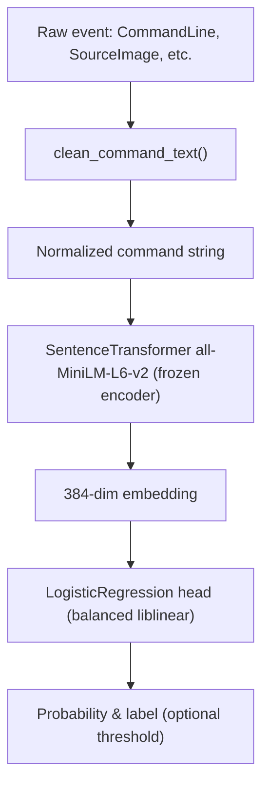

# Sentence-Transformer Text Baseline (EPIC F2)

This document explains the architecture, training flow, and inference inputs/outputs for the MiniLM sentence-transformer + logistic regression detector that augments the LotL Guard pipeline.

## Architecture Overview



### Components
- **Text normalization**: shared helper (`clean_command_text`) lowercases, trims whitespace, and collapses repeated spaces so embeddings are stable.
- **Sentence-transformer encoder**: default `sentence-transformers/all-MiniLM-L6-v2` (384 dim). The encoder is **frozen**; we do not fine-tune MiniLM weights in this phase. If you swap in a different model name, it will still act as a fixed feature extractor unless we add LoRA/QLoRA (planned in EPIC G).
- **Classifier head**: scikit-learn `LogisticRegression` with `class_weight="balanced"` and liblinear solver. This head is the only part trained/updated—MiniLM embeddings are treated as constants.
- **Metrics/thresholds**: the same reporting helper used by the TF-IDF model returns accuracy, ROC-AUC, average precision, per-label metrics, and macro/weighted averages. `scripts/plot_eval_curves.py` sweeps thresholds every 0.05 to create `st_threshold_metrics.json` (precision/recall/TP/FP/TN/FN for each operating point) plus ROC/PR/probability plots.

## Training Phase

1. **Prerequisites**
   - Run preprocessing/splitting (`make preprocess`) so `artifacts/processed.parquet` and `artifacts/splits.json` exist.
   - Ensure MiniLM weights are reachable:
     - **Online**: make sure this environment has outbound HTTPS and run  
       ```bash
       uv run python -c "from sentence_transformers import SentenceTransformer; SentenceTransformer('all-MiniLM-L6-v2')"
       ```  
       This downloads the model into the default cache.
     - **Offline / pre-cache**: download the model once on a machine with internet (`huggingface-cli download sentence-transformers/all-MiniLM-L6-v2 --local-dir /path/to/cache`) and set  
       ```bash
       export SENTENCE_TRANSFORMERS_HOME=/path/to/cache
       ```  
       before running any training/eval commands so the encoder loads from disk.
   - Activate the repo’s virtualenv or prefix every command with `.venv/bin/...`. The instructions below use explicit `uv run` invocations so they work even without activating the shell.

2. **Command**
   ```bash
   uv run python scripts/train.py --model st
   ```

3. **Outputs**
   - `artifacts/models/st.pkl` (dataclass bundling classifier + metadata)
   - `artifacts/models/st_classifier.pkl`
   - `artifacts/models/st_config.json` (model name, embedding dim, batch size, classifier params)
   - `artifacts/models/st_feature_list.json` (generated embedding column names)
   - `artifacts/eval/st_val_metrics.json` (accuracy, ROC-AUC, AP, per-label + macro/weighted stats)

## Inference Phase

While a dedicated inference wrapper is pending (EPIC H), the scoring loop works as follows:
1. Load `processed.parquet`, filter to the desired split, and normalize each `CommandLine`.
2. Encode texts with the same SentenceTransformer model recorded in `st_config.json`.
3. Load `st_classifier.pkl`, call `predict_proba` on the embeddings, and compare against your chosen threshold (e.g., from `st_threshold_metrics.json` or future calibration).

## Evaluation & Threshold Metrics

After training, run:
```bash
MPLBACKEND=Agg MPLCONFIGDIR=.matplotlib-cache \
uv run python scripts/plot_eval_curves.py \
  --model-path artifacts/models/st_classifier.pkl \
  --model-config-path artifacts/models/st_config.json \
  --text-mode sentence \
  --text-embedder-name all-MiniLM-L6-v2 \
  --prefix st \
  --output-dir artifacts/reports
```
`make evaluate` already executes this command (after the tree/text models) as long as `st_classifier.pkl` exists. The script:
- Re-embeds the validation split with the configured transformer.
- Generates ROC/PR/probability plots (`artifacts/reports/st_{roc,pr,prob}_curve.png`).
- Saves `artifacts/reports/st_threshold_metrics.json`, which contains every threshold (0.00 → 1.00 in 0.05 steps) with precision, recall, FPR/TPR, and TP/FP/TN/FN counts. Use this JSON as the supervisor-facing table to justify trade-offs.

## End-to-End Command Checklist

To go from raw data to trained model + evaluation artifacts:

1. **Preprocess + split**
   ```bash
   uv run python scripts/preprocess.py --input data/dataset.jsonl --artifacts artifacts
   ```
   (Or simply `make preprocess` if you prefer Make.)

2. **Warm up MiniLM cache (optional but recommended)**
   ```bash
   uv run python -c "from sentence_transformers import SentenceTransformer; SentenceTransformer('all-MiniLM-L6-v2')"
   ```

3. **Train the sentence model**
   ```bash
   uv run python scripts/train.py --model st
   ```

4. **Generate evaluation plots + threshold table**
   ```bash
   MPLBACKEND=Agg MPLCONFIGDIR=.matplotlib-cache \
   uv run python scripts/plot_eval_curves.py \
     --model-path artifacts/models/st_classifier.pkl \
     --model-config-path artifacts/models/st_config.json \
     --text-mode sentence \
     --text-embedder-name all-MiniLM-L6-v2 \
     --prefix st \
     --output-dir artifacts/reports
   ```

These commands produce:
- `artifacts/models/st_classifier.pkl`, `st_config.json`, `st_feature_list.json`
- `artifacts/eval/st_val_metrics.json`
- `artifacts/reports/st_roc_curve.png`, `st_pr_curve.png`, `st_prob_distribution.png`
- `artifacts/reports/st_threshold_metrics.json`

To evaluate on the held-out test split, extend `scripts/plot_eval_curves.py` with a `--split test` flag (planned follow-up) or replicate the steps above manually by filtering `processed.parquet` to `test_ids`.
